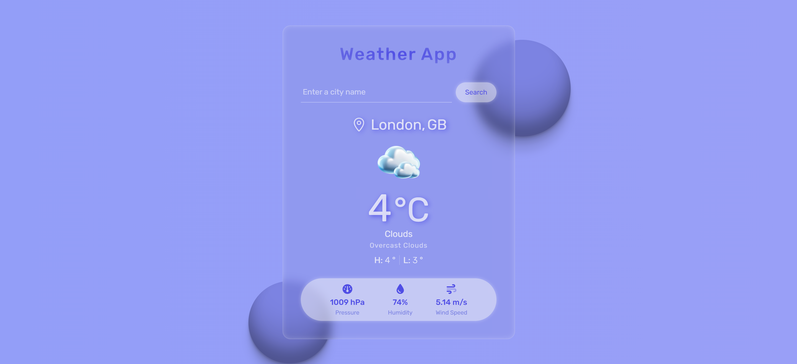

# Weather App

A modern and responsive weather application built with Vanilla JavaScript and Bootstrap.  
This project fetches real-time weather data from the [OpenWeatherMap API](https://openweathermap.org/api) and displays detailed weather information for any searched city.


## Live Demo

🔗 **View Online:**  
https://dorsa-piraneh.github.io/weather-app/

## Screenshots




## Features

- Fetch real-time weather data using OpenWeatherMap API
- Async/Await
- Search weather by city name
- Loading & Error Handling
- Dynamic DOM Rendering
- Enter key support for faster search

## 📝 Notes

- The project depends on the OpenWeatherMap free API plan.
- API responses and available data fields may vary depending on subscription type.
- Error messages returned by the API are displayed in a user-friendly format.

## Installation & Usage

### Option 1: Run Locally (No Git Required)
1. Download the project as ZIP.
2. Extract the files.
3. Open `index.html` in your browser.

### Option 2: Clone with Git
```bash
git clone https://github.com/dorsa-piraneh/weather-app.git
```
Then open `index.html` in your browser.

## Project Structure

```txt
weather-app/
│   index.html
│   README.md
│
├───assets
│   ├───fonts
│   │   └───Rubik
│   │
│   ├───icons
│   │   ├───3D-Icons
│   │   └───FontAwesome
│   │
│   ├───images
│   │
│   └───libs
│       ├───bootstrap
│       └───sweetalert2
│
├───css
│       main.css
│       normalize.css
│
└───js
        main.js

```

## Technologies Used

- HTML5
- CSS3 / CSS Variables
- Bootstrap 5
- JavaScript (ES6+)
- SweetAlert2
- FontAwesome Icons
- OpenWeatherMap API


## Future Improvements

- Add geolocation support (auto-detect user location)
- Add 5-day / hourly forecast
- Add temperature unit toggle (°C / °F)


## Author

**Dorsa Piraneh**  
GitHub: https://github.com/dorsa-piraneh
